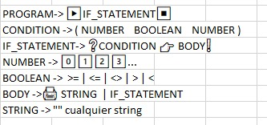

# Emojilang 😹💻

## Gramática utilizada

### Descripción del lenguaje generado

Representa una estructura de control (if) para el lenguaje de programación emojilang, con la caracterísitica de usar un emoji de play y stop para definir el inicio y el final del programa respectivamente; el body de la estructura de control puede incluir una estructura de control (if ❓(NUMBER BOOLEAN NUMBER)) o una instrucción de impresión (print 🖨️STRING).

### Cadenas aceptadas

<code>
<pre>
▶
    ❓(4 <= 1)➡
        ❓(1 == 2)➡
            🖨'hola mundus!'
        ❗
    ❗
⏹
</pre>
</code>

<code>
<pre>
▶
   🖨'hola mundus!'
⏹
</code>
</pre>

<code>
<pre>
▶
    ❓(1 >= 2)➡
        🖨'hola mundus!'
    ❗
⏹
</code>
</pre>

<code>
<pre>
▶
    ❓(4 > 2)➡
    ❓(1 > 1)➡
    ❓(9 > 2)➡
    ❓(3 > 1)➡
        🖨'hola mundus!'
    ❗
    ❗
    ❗
    ❗
⏹
</pre>
</code>

### Cadenas rechazadas
    
<pre>
<code>
▶
⏹
</code>
</pre>

<code>
<pre>
▶
    ❓(4 > 2)➡
    ❓(1 > 1)➡
    ❓(9 > 2)➡
    ❓(3 > 1)➡
        🖨'hola mundus!'
        🖨'hola mundus!'
    ❗
    ❗
    ❗
    ❗
⏹
</code>
</pre>

<code>
<pre>
▶
    ❓(4 > 2)➡
    ❗
⏹
</code>
</pre>

<code>
<pre>
▶
    ❓(4 >>> 2)➡
    ❗
⏹
</code>
</pre>

<code>
<pre>
▶
    ❓(4> 2)➡
    🖨'hola mundus!'
⏹
</code>
</pre>

<code>
<pre>
▶
    ❓(4> 2)➡
    🖨'hola mundus!'
    ❗
</pre>
</code>
